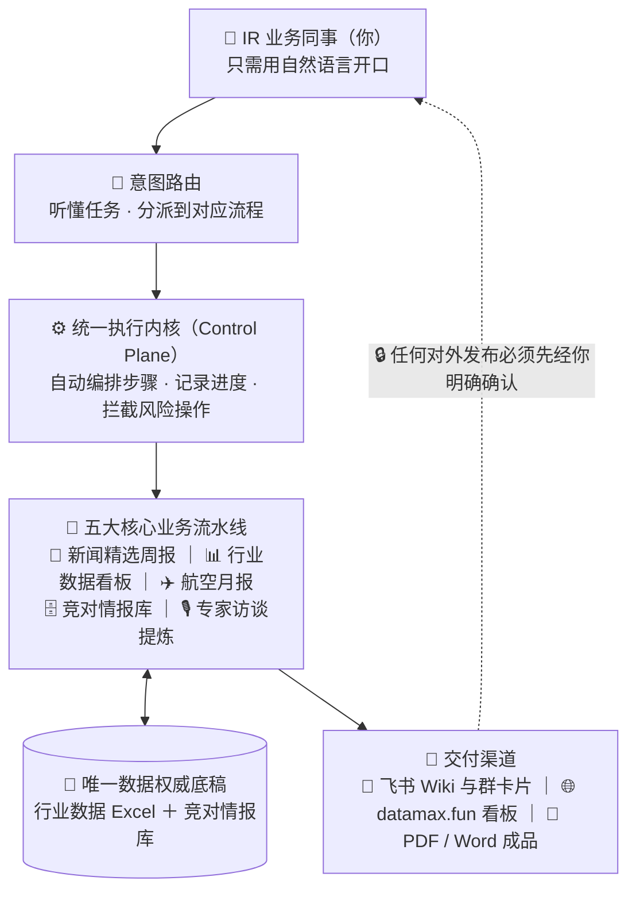

# 携程 IR 部门 · AI 自动化工作台（IR Workbench）
## 系统功能、架构机制与业务人员使用交接手册

---

### 📖 文档说明（写在前面）
这份文档专为**完全没有编程或技术背景的 IR 同事、接手人及部门主管**编写。
你**不需要懂代码、不需要开黑底终端命令行、不需要了解 Python**。你只需要像平时跟同事沟通一样，在 AI 对话框（如 Cursor / Kiro / Claude Code）里**用自然语言说话**，系统就会自动帮你完成日常重复繁琐的情报搜集、公式核算、底稿维护、看板上线、飞书发布与情报归档。

---

## 一、 系统定位：这个工作台是干什么的？

在 IR（投资者关系）的日常工作中，我们每周、每月、每季度都有大量高频且极度消耗时间的例行任务：
1. **周度新闻精选**：在海量资讯中找同行与行业动作，手工去重、写增量分析、排版成 PDF/HTML 并发布到飞书 Wiki 与内部群卡片。
2. **国内行业数据与看板**：拿到 STR 酒店数据和航司周报后，填入 Excel 底稿，算同比环比，写中英文洞察摘要，再同步更新到外部可视化看板。
3. **民航月度官方数据更新**：去民航局和三大航官网扒公告，抄数字、算同比、填入特定单元格。
4. **竞对情报沉淀与检索**：日常搜集的零散信息在写季度财报（Appendix）或准备业绩会发言时经常找不到，需要重新回溯翻找。
5. **专家访谈提炼与留存**：拿到十几页甚至几十页的专家电话会纪要，提炼其中独家的经营数据与行业事实，归档备查，并挑出高价值内容做精选。

**本系统的核心目的**：
> **把所有“机械、重复、易抄错、易漏读”的脏活累活交给后台自动化；把“业务判断、文字定稿、数据决策与最终发布”的权利牢牢留在业务人员手中。**

---

## 二、 第一次使用：三步开箱（一次性准备）

> 这一节只在**第一次拿到工作台**（或换了新电脑）时做一次。做完之后，日常永远只需要「开口说话」。

### 第 1 步：装好三样软件 + 两个搜索插件

| 要装的东西 | 装它干嘛 | 怎么装 |
| :--- | :--- | :--- |
| **Cursor**（AI 对话软件） | 你和这个系统对话的窗口，公司有会员 | 官网下载安装，登录公司账号 |
| **Python 3.14 或更高版本** | 工作台后台的运行环境 | 官网下载安装包，安装时务必勾选 **Add to PATH**；搞不定请交付人或 IT 协助 |
| **Node.js**（LTS 版） | 安装飞书工具 lark-cli 的前提 | 官网下载，一路下一步 |
| **lark-cli**（飞书命令行工具） | 所有飞书读写都靠它：发周报、发卡片、写 Wiki | 装完 Node.js 后，对 AI 说「帮我装 lark-cli」即可 |
| **Cursor 插件：exa** | 新闻精选的中文检索主力，没它召回质量明显变差 | Cursor 插件市场搜 `exa`，按提示填 API key（找交付人/部门获取，或自行注册，有免费额度） |
| **Cursor 插件：tavily** | 新闻精选的短关键词补充检索 | 同上，搜 `tavily` |

> 可选项：想让新闻精选导出 **PDF**（不只 HTML），再对 AI 说一句「帮我装 playwright」。

### 第 2 步：打开工作台，让 AI 帮你初始化

1. 从交付人处拿到完整的 `IR_workbench` 文件夹，放到自己电脑上。
2. 用 Cursor 打开这个文件夹（左上角：文件 → 打开文件夹）。
3. 打开右侧 AI 对话框，说：👉 **「帮我做首次初始化：安装工作台依赖、检查飞书授权」**
   - AI 会自动安装依赖；如果你本机还没授权过飞书，它会一步步引导你**用自己的飞书账号**扫码完成授权（授权跟随本机登录者，换人也走同一套流程，不绑任何人的账号）。

### 第 3 步：跑一次环境自检

对 AI 说：👉 **「做一次环境自检」**

- 全部 ✅ = 可以正式开工。
- 出现黄/红项不用慌——AI 会用人话告诉你缺什么、怎么补（例如「缺 PDF 导出工具，要现在装吗」）。

> 开箱完成后，日常使用回到「上手流程」那张图：**开口 → 审草稿 → 确认 → 收成果**。

---

## 三、 系统整体架构与运转流程

虽然后台有严谨的工程代码在跑，但对你来说，**整个系统的交互界面就是一个聪明的 AI 助理**。

### 1. 整体架构分层图



> 另有三个轻量查询能力（港股行情、研报摘读、季度财报跟踪）按需随问随用，不占用日常流程，故未画入上图。

---

### 2. 上手流程：开口 → 审草稿 → 确认 → 收成果

对新人来说，用这个系统永远只有同一个三步循环——**你开口、你审阅、你确认**，其余全是系统的事：


> 🔒 **安全门**：第 2 步和第 3 步之间有一道闸——在你明确说「确认 / 发布 / 写入上线」之前，系统只演练、不动真格，绝不会擅自改数据或对外发布。

两个最常见的「输入什么 → 得到什么」：

| 你开口说 | 系统给你看的草稿 | 你确认后得到 |
| :--- | :--- | :--- |
| 「更新国内行业数据」 | 本周变动单元格清单 + 中文洞察草稿 | datamax.fun 看板刷新 + 中英文洞察入库 |
| 「做这周的新闻精选」 | 已查重的精选草稿（带数字与竞对含义） | 飞书 Wiki 周报 + 本地 PDF/HTML + 情报自动入库 |

---

## 四、 五大核心功能模块详解（能帮你干什么）

| 模块名称 | 解决什么问题 | 你怎么对 AI 开口 | 产出物与去向 |
| :--- | :--- | :--- | :--- |
| **1. 旅行行业新闻精选与周报**<br>`news-digest` | 每周汇总 OTA 与旅游行业重大事件、竞对动态，提炼具体数字与含义，制作交付物。 | 🗣️ *“做 2026年8月第3周的新闻精选”*<br>🗣️ *“做这周的飞书卡片周报”* | ① **Markdown / HTML / PDF** 三份本地文件<br>② 自动发布到**飞书 Wiki** 知识库<br>③ 自动打标存入**竞对情报库**<br>④ 生成**飞书群互动卡片** |
| **2. 国内行业数据与看板**<br>`industry-data` | 维护国内酒店 STR、周度航空等高频数据，自动发现变动、生成中英文洞察、同步线上可视化看板。 | 🗣️ *“更新国内行业数据”*<br>🗣️ *“用这份最新的中金周报更新看板”* | ① 自动比对数据差异<br>② 自动生成**中文/英文核心洞察**<br>③ 自动更新发布到 **datamax.fun 看板** |
| **3. 航空月度官方数据填表**<br>`aviation-monthly` | 每月中旬民航局和三大航出月报后，自动抓取官方披露并计算同比，填入底稿。 | 🗣️ *“更新 7 月航空官方数据”* | ① 自动抓取并核算 16 个指标<br>② **自动回填到 Excel 底稿**指定格<br>③ 自动生成带来源批注的记录表 |
| **4. 竞对多维情报库**<br>`competitor-intel` | 解决日常信息散落各处、季度写财报时找不到历史口径的问题。按公司/主题随时横切纵切检索。 | 🗣️ *“Booking 这季度在 B2B 上做了什么”*<br>🗣️ *“所有 peers 在 AI 入口上都怎么说的”* | 随时调阅结构化情报（覆盖 Booking, Airbnb, Expedia, 美团, 同程, 飞猪, 抖音, 携程等） |
| **5. 专家访谈提炼与精选**<br>`expert-calls` | 从几十页的专家电话会纪要中，提炼行业事实、经营数据和因果机制，并挑选优质内容上飞书。 | 🗣️ *“读一下这几篇专家访谈，提炼有价值的信息入库”*<br>🗣️ *“看看这些访谈哪些值得写进飞书”* | ① 提取带**专家原话与页码溯源**的内部事实入库<br>② 对访谈质量进行**透明评分 (A/B/C)**<br>③ 确认后独立生成格式排版并发布飞书 |

> **补充轻量查询能力**：
> - **港股市场查询**（`hk-market`）：口头问 *“查一下港美成交占比现在多少”*、*“南向持股这周怎样”*。
> - **卖方研报摘读**（`sellside-research`）：把券商 PDF 拖进对话框，口头说 *“帮我摘一下这份报告的核心要点”*。
> - **季度财报**：先问情报库 *“Booking 这季度做了什么”*。Appendix 正文仍由人写，工作台不自动贴图改 Word。

---

## 五、 系统的四大安全机制：为什么你可以完全放心？

很多非技术同事担心：“AI 会不会自己乱改数据？”、“会不会把没确认的内容偷偷发出去？”。
本工作台在底层设计了**极度严苛的四大安全机制**，任何越界行为都会被底层代码直接锁死：

### 1. 唯一权威底稿制（单源真理）
- **绝不允许多份 Excel 满天飞**：整个工作台只认 `data/workbooks/国内行业数据.xlsx` 这一份底稿。
- 要修改数据、补充历史数据，**直接打开这一个 Excel 修改即可**。系统生成的 JSON、网站看板全都是由这份 Excel 计算出来的投影，改了 Excel 底稿，看板就会同步。

### 2. 绝对“演练确认制”（Dry-Run 门禁）
- **绝不擅自对外发布**：无论是往飞书发文档、发卡片，还是把数据推上外部网站，AI 在你**没有明确回复“确认发布”或“写入上线”之前，永远只停留在草稿和演练阶段（Dry-Run）**。
- **绝不擅自覆盖手填数据**：如果中金周报有新数，系统只会自动补齐空白单元格，凡是你手工修改过的格子，系统绝对不会私自覆盖。

### 3. 全程工单与进度记忆（Manifest 台账）
- 系统后台为每一周、每一月的任务都建立了一份类似“电子工单”的记录（Manifest）。
- **换人换会话不迷路**：今天做了一半关掉电脑，明天打开对话框问一句 *“现在什么状态”*，AI 能够秒级读出上次做到第几步、哪些通过了、下一步该由你确认什么，绝不会重复执行或遗漏。

### 4. 发布后自动“回读对账”与防错拦截
- **防乱码**：底层全链路强制采用 UTF-8 编码，彻底解决 Windows 电脑下中文变成乱码的问题。
- **防误清空**：如果 Excel 底稿被不小心误删了 10 格以上，系统会**立即亮红灯报警并拒绝同步**，防止错误数据冲上看板。
- **写入后自动回读**：向飞书 Wiki 写入周报后，系统会自动调取飞书接口把刚刚写进去的内容重新读一遍，核对段落数、附件数是否完全一致。

---

## 六、 日常使用操作手册（怎么用）

作为业务使用者，你日常工作只需要掌握以下**三步工作法**：

### 场景演示 1：每周五发布“国内行业数据与看板”
1. **第一步：发起请求**
   - 你在 Excel 里填完本周 STR 酒店或航空数据后，保存文件。
   - 打开对话框，对 AI 说：👉 **“更新国内行业数据”**
2. **第二步：审阅草稿**
   - AI 会在后台自动比对 Excel，列出本周变动的单元格，并给出周度中文洞察草稿。
   - AI 会回复你：*“本周更新了 6 个指标，中文洞察草稿如下：…… 请审阅。如果确认请说‘写入上线’。”*
3. **第三步：确认上线**
   - 你看完觉得洞察写得很准确（或让 AI 稍微微调两句），回复：👉 **“确认无误，写入上线”**
   - AI 会自动入库、翻译成英文版、推送到 datamax.fun 看板，并汇报完成。

---

### 场景演示 2：每周撰写并发布“旅行行业新闻精选”
1. **第一步：让 AI 找素材并查重**
   - 对 AI 说：👉 **“做这周的新闻精选”**
   - AI 会检索本周新闻，自动剔除过去写过的内容，生成一份带事实、具体数字与竞对含义的精选草稿。
2. **第二步：人工润色与定稿**
   - 你根据业务判断对草稿进行微调（AI 不会替你编造主观观点，核心判断由人把关）。
3. **第三步：一键发布与多方沉淀**
   - 对 AI 说：👉 **“正文定稿了，发布到飞书”**
   - AI 会自动：
     - 生成本地 PDF 与 HTML 文件存入 outputs 目录；
     - 自动把内容排版好，写入部门飞书 Wiki 知识库；
     - 自动提取当期新闻要点，存进竞对情报库；
   - 随后如果你需要往内部群发卡片，对 AI 说：👉 **“做这周的飞书卡片周报”**，AI 就会把做好的精美卡片直接私聊发到你的个人飞书上，你点击转发到群即可！

---

### 场景演示 3：日常日常查数与情报检索
无需翻找陈年文件夹，直接提问：
- 👉 *“查一下 Booking 这季度在 B2B 和 AI 方面做了哪些动作？”*
- 👉 *“Expedia 上次电话会里是怎么讲流量入口（AEO）的？”*
- 👉 *“查一下现在港美股成交占比是多少，有没有超 55%？”*

---

### 遇到异常或不知道该干嘛时？
直接在对话框输入以下三句话之一，AI 会自己诊断并告诉你：
- 🗣️ **“现在什么状态？”** —— 查看当前各模块进度、停在第几步、在等谁确认。
- 🗣️ **“做一次环境自检”** —— 检查飞书连接、Excel 路径、网络与运行环境是否正常。
- 🗣️ **“换一份新的国内行业数据”** —— 收到主管或同事发来的全新 Excel 时，让 AI 帮你安全替换并重新绑定。

---

## 七、 文件夹目录速查（重要资产放哪里）

工作台的文件夹结构非常规范，你平时只需要关注以下几个地方：

```text
IR_workbench/
├── data/
│   └── workbooks/              # ⭐️ 核心数据底稿！《国内行业数据.xlsx》就在这里（改数只改它）
├── inputs/                     # 📥 每周每月的原始素材输入地（如放入中金周报表、研报PDF、专家访谈原件）
├── outputs/                    # 📤 最终成品输出地（生成的精选 PDF、HTML、Word 总结都自动保存在这里）
├── docs/                       # 📚 系统全部设计文档、术语字典与业务功能清单
└── modules/                    # ⚙️ 业务处理代码库（日常不用点进去看）
```

---

## 八、 铁律与交接纪律（请接手同事牢记）

为了保证整个系统长期健康、安全地跑下去，请牢记以下**四条底线**：

1. ❌ **不要手动去改 `data/canonical/` 里的 JSON 文件**
   - 任何行业数据有变动，**一律去改 `data/workbooks/` 里的 Excel**，系统会自动同步。
2. ❌ **新闻精选里绝不写携程（TCOM）自己的新闻**
   - 行业新闻精选是看外部竞争格局的，携程自己的事件 IR 团队内部都清楚，写进去属于冗余。
3. ❌ **不要跳过确认直接要求对外发布**
   - 保持“先看草稿演练、再回复确认发布”的习惯，这是保护你自己和部门数据安全的最强屏障。
4. 💡 **飞书账号是跟随当前电脑登录者的**
   - 系统不会绑死任何离职同事的账号。你在本机电脑登录你的飞书客户端后，系统就会自动以你的身份安全操作。

---

### 🎯 总结
这套工作台不是冷冰冰的代码，而是**将资深 IR 分析师的工作方法、质检标准、安全防错经验固化下来的智能化业务底座**。
你不需要成为技术专家，你依然是那个拥有敏锐商业洞察的业务掌舵人，而这个工作台，就是你最可靠、不知疲倦的 7x24 小时分析师助理。祝使用愉快！
