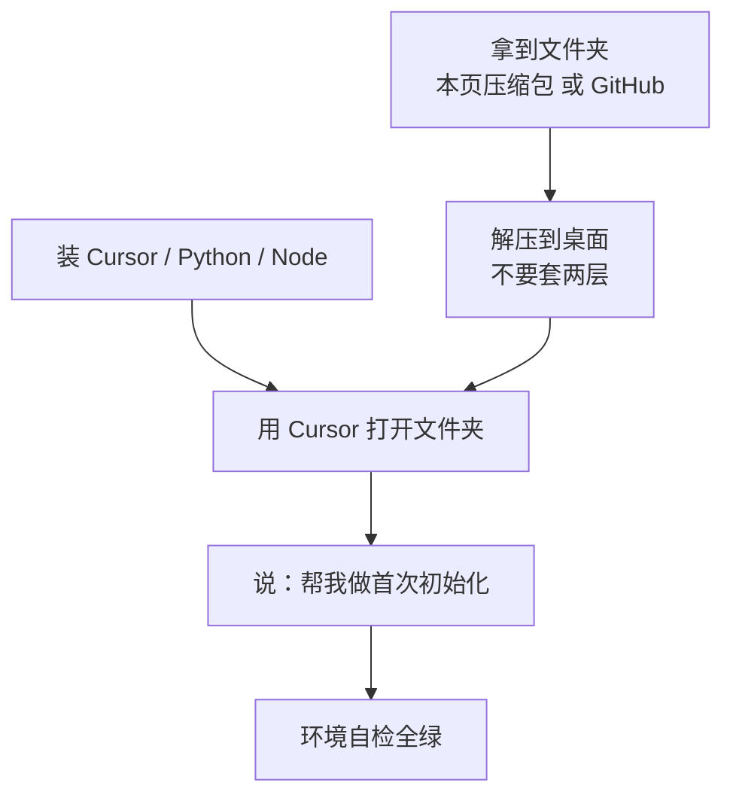
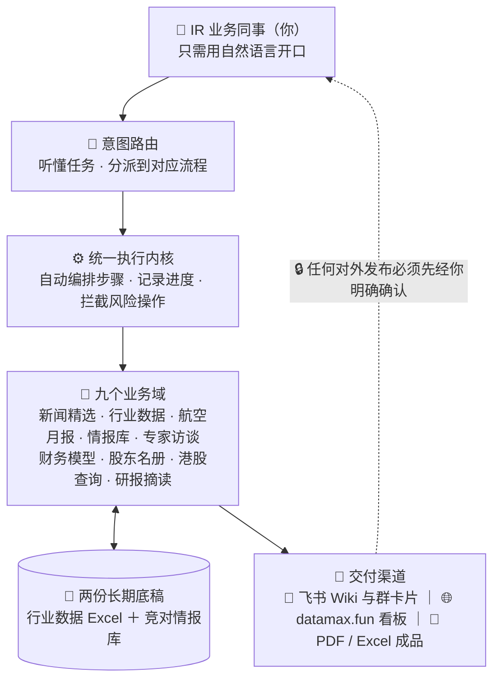
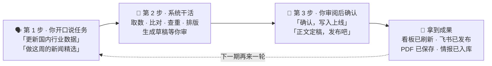
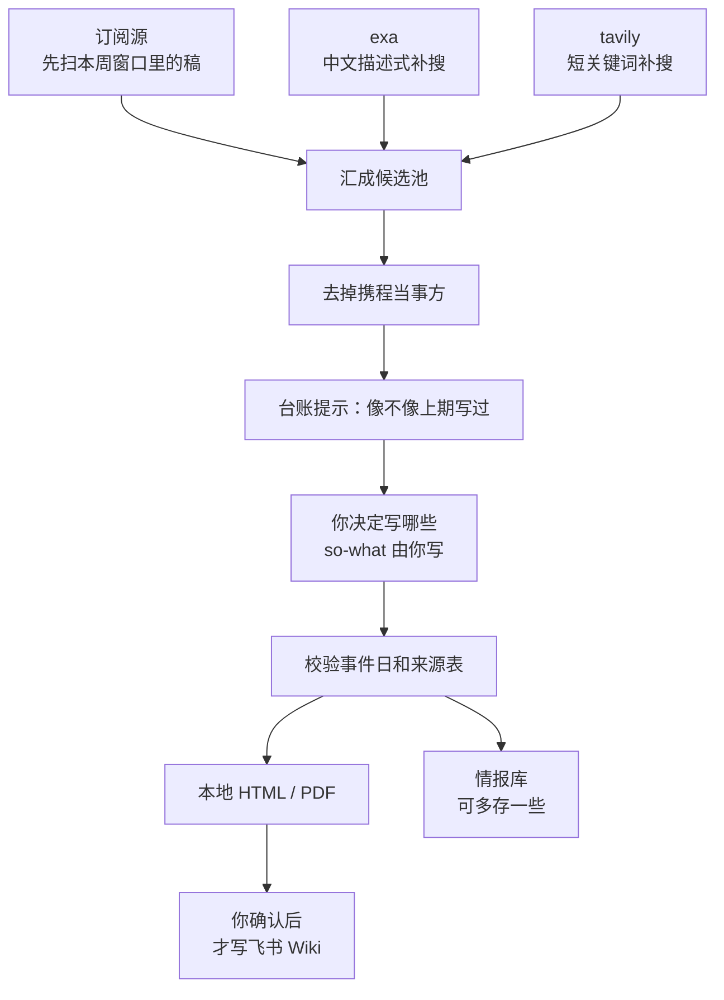
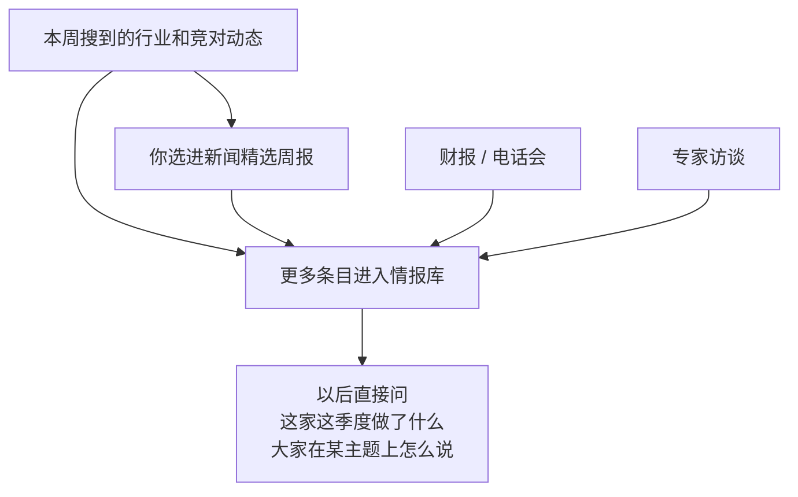
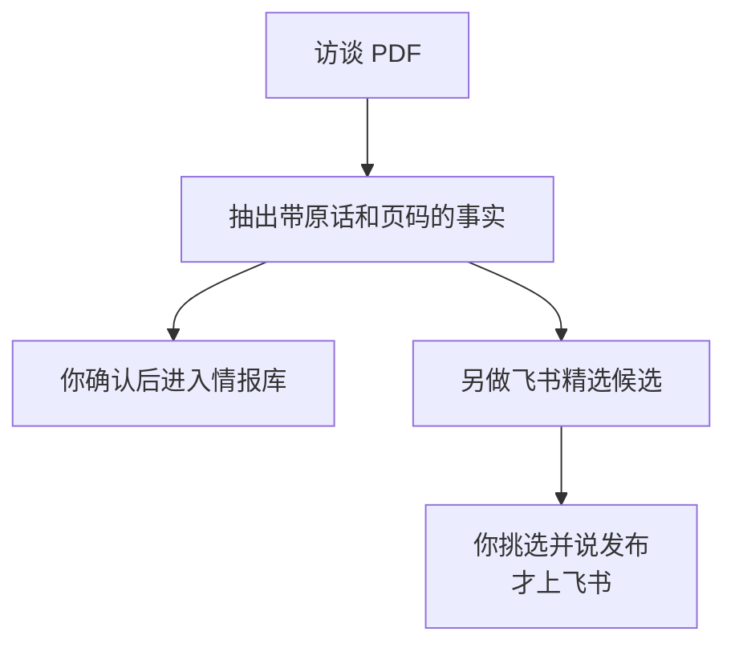

# 携程 IR 部门 · AI 自动化工作台

> 飞书版与本文同一份：https://trip.larkenterprise.com/docx/U3tWdBWT4oOKK3xEQqgcufwNndc
>
> 给没有技术背景的同事。你不需要懂代码，也不需要自己敲命令。用 Cursor 打开工作台文件夹，在右侧对话框里像跟同事交代任务一样说话即可。
>
> 改权威数据、往外发东西，都要你先说「确认」。没这句话，系统只出草稿、做演练，不会改表，也不会写飞书。

## 一、这个工作台是干什么的

IR 每周、每月、每季度都有一批又耗时间又容易抄错的例行工作。工作台把其中机械的部分接过去，判断仍留在你手里：写哪条、信哪个口径、能不能发出去，都要你点头。

目前一共九件事。对外只交一份：旅行行业新闻精选。其余都是内部用的。

| 事项 | 节奏 | 干什么 |
|---|---|---|
| 旅行行业新闻精选 | 每周 | 找同行和行业动作，写成周报；确认后发飞书，要点进情报库 |
| 国内行业数据与看板 | 每周 / 每月 | Excel 有变动就出洞察草稿，你确认后刷新 datamax.fun |
| 航空月度官方数据 | 每月 | 抓民航局和三大航公告，算同比，填进底稿指定格 |
| 竞对情报库 | 随时查，每季可补 | 按公司或主题问最近做了什么、怎么说的 |
| 专家访谈 | 材料到了就做 | 从纪要里捞独家事实入库；值得展示的另发飞书 |
| Peers 财务模型 | 季报 / 半年报 / 年报 | 把财报数字写入 Excel 副本，原模型不动 |
| 机构股东名册 | 每季 | 用 Capital IQ 两张底表生成完整名册 |
| 港股市场查询 | 按需 | 南向持股、港美成交占比（盯 55% 那条线） |
| 卖方研报摘读 | 按需 | 把 PDF 拖进来帮你读、帮你摘，不建档案 |

## 二、第一次使用：拿到文件夹，再开箱

只在第一次拿到工作台、或换了新电脑时做。做完之后，日常只开口说话。软件和文件夹哪边先都行。文件夹两种拿法选一种即可。

### 先拿到工作台文件夹

| | 本页压缩包 | GitHub 私有仓 |
|---|---|---|
| 适合 | 第一次装，最快 | 以后要跟着仓库更新，或压缩包下不动时 |
| 怎么拿 | 点本页附件下载 | 交付人把你的 GitHub 账号加进仓之后，再从网页下 |
| 里面有什么 | 行业数据 Excel、三份 Peers Model、代码和说明 | 同一份内容，且能跟着仓库更新 |
| 注意 | 这是 2026年9月4日的快照，过几个月不要再当最新版用 | 没被加进仓，网页会打不开 |

**办法一：下本页压缩包。**飞书版点下面的附件 `IR_workbench-首次安装-20260904.zip`。解压到桌面。打开解压出来的文件夹，应直接看到 `AGENTS.md`、`docs` 这些，不要变成 `IR_workbench\IR_workbench` 套两层。压缩包大约十几 MB。

**办法二：从 GitHub 下。**仓是私有的：https://github.com/ZEYICHEN-md/ir-workbench 。把你的 GitHub 用户名发给交付人，加进仓之后用浏览器打开这个地址（先登录 GitHub）。页面右侧绿色的 **Code**，再点 **Download ZIP**。解压后文件夹名可能是 `ir-workbench-main`，放到桌面即可，改名叫 `IR_workbench` 也行。已经加进仓的，也可以对 AI 说「帮我从 GitHub 把工作台拉到桌面」，让它帮你 clone，后面说「更新工作台」会方便一些。

这两种都是第一次用的现成文件夹。过几个月不要再下旧压缩包覆盖。对 AI 说「更新工作台」即可。

### 第 1 步：装软件和两个搜索插件

| 要装的 | 干什么 | 怎么装 |
|---|---|---|
| Cursor | 你和系统说话的窗口，公司有会员 | [cursor.com/download](https://cursor.com/download) 安装，登录公司账号 |
| Python 3.14 或更高 | 工作台运行环境 | [python.org/downloads](https://www.python.org/downloads/) ，安装时勾选 Add to PATH；搞不定找交付人或 IT |
| Node.js（LTS） | 装飞书工具的前提 | [nodejs.org](https://nodejs.org/en/download) ，一路下一步 |
| lark-cli | 发周报、发卡片、写 Wiki 都靠它 | 装完 Node 后，对 AI 说「帮我装 lark-cli」 |
| Cursor 插件 exa | 新闻精选的中文检索主力 | 插件市场搜 exa，按提示填 API key |
| Cursor 插件 tavily | 短关键词补充检索 | 同上，搜 tavily |

想导出新闻精选 PDF（不只 HTML），再对 AI 说「帮我装 playwright」。

### 第 2 步：打开工作台，让 AI 做初始化

1. 把解压好的 IR_workbench 文件夹放到桌面（或你习惯的位置）。
2. 用 Cursor 打开这个文件夹。
3. 对右侧 AI 说：「帮我做首次初始化：安装工作台依赖、检查飞书授权」。飞书会引导你用**自己的账号**扫码。授权跟这台电脑当前登录的人走，不绑任何人。

### 第 3 步：做一次环境自检

对 AI 说：「做一次环境自检」。全绿就可以开工。出现黄项或红项，它会告诉你缺什么、怎么补。

## 三、整体怎么转：看两张图就够

### 1. 分层：你说话，系统分到九件事里

对你来说，界面就是右侧那个 AI。它听懂你要做哪一类，去读写底稿和成品，再用人话回报。行业看板、洞察、飞书卡片里的行业数字，都来自那张被锁定的《国内行业数据》Excel。竞对「最近做了什么」来自情报库。改数只改 Excel；查口径去问情报库。

### 2. 每次都走同一条：开口 → 审草稿 → 确认 → 收成果

第 2 步和第 3 步之间有一道闸。你没说「确认 / 发布 / 写入上线」之前，系统只演练，不改真数据，也不对外发。

| 你开口说 | 先看到的草稿 | 你确认后得到 |
|---|---|---|
| 更新国内行业数据 | 本周变动格子 + 中文洞察草稿 | datamax.fun 看板 + 中英文洞察 |
| 做这周的新闻精选 | 已查重的精选草稿 | 飞书 Wiki + 本地 PDF/HTML + 情报入库 |

## 四、九件事一览：开口和产出

先看总表。具体怎么走、背后做了什么，在第五节、第六节。

| 事项 | 解决什么 | 你怎么开口 | 产出去哪 |
|---|---|---|---|
| 新闻精选 | 每周汇总 OTA 和旅游行业动作 | 做这周的新闻精选；做这周飞书卡片周报 | 本地三件套；确认后飞书 Wiki；要点进情报库；卡片私聊给你转发 |
| 行业数据与看板 | STR、航司周报填表，出洞察，刷新看板 | 更新国内行业数据；用这份中金周报更新看板 | 中英文洞察；你说写入上线后刷新 datamax.fun |
| 航空月报 | 抄民航局和三大航公告、算同比 | 更新 7 月航空官方数据 | Excel 指定格 + 每格来源记录 |
| 竞对情报库 | 季度研究时不用重新翻文件夹 | Booking 这季度在 B2B 上做了什么；peers 在 AI 入口上怎么说 | 按公司或主题给出带出处的回答 |
| 专家访谈 | 独家经营数据和行业事实有地方存 | 读这些访谈，把有价值的信息入库；看看哪些值得写进飞书 | 带原话和页码的事实入库；选定后才发飞书精选 |
| Peers 财务模型 | 把新业绩写入财务 Excel | 这是 BKNG 26Q3 财报，更新 Model | 只出副本，原模型不覆盖 |
| 股东名册 | 看股东结构，并和 peers 横向比 | 更新 shareholder list，有效日切成今天 | Investor List 表格。你主要负责下载两张底表 |
| 港股查询 | 南向、港美成交占比 | 港美成交占比现在多少 | 口头报数。55% 口径看最近完整财年 |
| 卖方研报 | 快速读一份报告 | 拖进 PDF，帮我摘一下这份报告 | 摘要。不建档案，不进情报库 |

## 五、重点看清：新闻精选怎么做，和情报库什么关系

这两件事最容易混，也最需要知道系统在后台干了什么。其余功能按第六节的场景走即可。

### 5.1 你怎么用新闻精选

**你准备：**开口即可。有剪报可以拖进对话框，不是必须。

**开口：**「做这周的新闻精选」，或指定「做 2026年8月第3周的新闻精选」。

1. 系统去搜、过滤、查重，把候选和草稿给你。
2. 你决定写哪些、so-what 怎么写、数字对不对。观点它不代写。
3. 定稿后出本地 Markdown、HTML、PDF，并单独问你要不要发飞书 Wiki。你说可以，才更新旅业资讯库和历史周报汇总。
4. 同期给你一份情报打标草稿。核对公司标签后确认，要点进情报库。
5. 要往内部群发卡，另说「做这周飞书卡片周报」。卡片私聊发到你自己的飞书，你再转发。不绑别人的账号。

### 5.2 背后：新闻是怎么搜、怎么过滤、怎么查重的

不能靠一句「本周 OTA 有什么新闻」去盲搜。开放搜索会被当周最大声量的话题挤满，同周其他酒旅重点会漏。所以先用订阅源把本周窗口里能稳定拉到的稿扫一遍（英文侧 Skift，中文侧 36氪等），再用两套搜索补洞：中文描述式问法交给 exa，短关键词交给 tavily。两套问法不一样，同一句话不要喂两边。环球旅讯、晚点这类订阅经常拉不下来，就靠这一步补。

搜到的稿还不能直接当本周新闻。文章发出的日期只说明它被发现了；算进哪一周，看事件发生日。本周只是复盘旧事、没有新信息的，不收。每条都要能说清：本周新增了什么。

携程自己当当事人的新闻不写，包括被约谈、被处罚、发自家财报或产品。这类境内事件 IR 已经第一时间掌握，写进对外周报没有增量。标题里出现「携程」会被拦住。正文为了写对竞对的含义提到携程，可以。

查重只提示，不替你拍板。系统有一份跨期台账，用链接、事件指纹（谁做了什么）、标题相似度，标出「这条像不像上期写过」。是不是跟进报道，由你看。自动丢掉会漏真正该写的跟进，比如上期写了 Booking 的 B2B，这期才是 CEO 兼任。

召回、查重、校验、导出、沉淀是系统做的。那两三句 so-what 是你做的。

### 5.3 新闻周报和情报库怎么连

周报是对外交的那一份，要克制。情报库是内部随时能问的档案，可以多存。跑每周新闻时，会并行提示你把事件落入情报库。正常情况下，进情报库的事件包含进周报的事件，而且更多。以后写 Appendix 或准备业绩会，直接问「Booking 这季度在 B2B 上做了什么」，不用重新翻文件夹。

库还有另外两处来源：财报和电话会材料（按需交 PDF 或材料包），以及专家访谈。三条线进同一个库，查询按公司纵切，或按主题横切。

## 六、其余功能：你做什么，输入什么，得到什么

### 场景 1：每周更新国内行业数据与看板

1. 在锁定的那份《国内行业数据》Excel 里填好本周 STR 或航空数字，保存。若有中金周报，拖进对话框。
2. 说「更新国内行业数据」，或「用这份中金周报更新看板」。
3. 系统逐格比对上次，只对真的变了的周、月、季出中文洞察草稿。你改两句或点头后，说「确认无误，写入上线」。

确认后才会入库、译英文、推到 datamax.fun。飞书多维表现在不走默认链路，需要时单独说。中金表只填空着的格子，你手填过的值不会被盖掉。一次空出太多格会停下来问你，防止误删冲上看板。

### 场景 2：每月写入航空官方数据

开口：「更新 7 月航空官方数据」。系统先抓民航局和三大航公告，算同比，把打算写的格子摆给你看。你确认后才写入 Excel，并留下每一格从哪张公告、哪一行来。想留 PDF 底可以放进收件箱，不是必须。

### 场景 3：查情报、查港股

直接问即可，不必自己翻目录。

- 「Booking 这季度在 B2B 和 AI 方面做了哪些动作？」
- 「Expedia 上次电话会怎么讲流量入口（AEO）？」
- 「港美成交占比现在多少，有没有超 55%？」

建档公司包括 Booking、Expedia、Airbnb、美团、同程、飞猪、豆包/抖音、携程。华住、亚朵、万豪等可以搜到，跟踪更轻，不会按完整经营模型拆。要把当季财报或电话会存进库，把材料交给 AI。公司披露里能核对上的可以自动入库；两边数字不一致、或口径没写清的，会单独拎出来问你，不会替你选哪个数。

港股盯 55% 那条监管线时，口径是最近完整财年，不是随口一个滚动 12 个月。

### 场景 4：专家访谈入库，以及是否上飞书

从 AlphaSense 下载 PDF，拖进对话框。开口：「读一下这些专家访谈，把有价值的信息存进公司情报库」；「看看这些访谈哪些值得写进飞书」。

系统按页抽出带专家原话和页码的事实。你分成可以正式入库、先待核、不要三档，确认后才写入情报库。待核的不会自动转正。飞书精选是另一条线，给建议档 A/B/C，只辅助你选。你选定并明确说「发布专家访谈精选」，才写飞书。

一篇访谈可以不上飞书，里面可核对的数字仍能进库。发了飞书也不等于已经入库。两条确认是分开的。平时有材料就丢给工作台，等于在攒部门自己的 OTA 知识库。

### 场景 5：更新 Peers 财务模型

业绩总结正文仍由人写。工作台只更新 Excel 和图表，不自动做 Word Appendix。

一次交一家公司的财报或电话会 PDF。三份权威 Model 已在工作台里：BKNG / EXPE / ABNB 共用一本，美团一本，同程一本。开口：「这是 BKNG 26Q3 财报，更新 Model」。

系统先抽数，再独立重读 PDF 复核。有冲突先列给你选。你说「确认写入模型副本」之后，才在副本上加期间列、套上期格式、更新图。原模型不覆盖。写完会关掉重开 Excel 再对一遍。同程只动该动的前两个数据表。

### 场景 6：更新股东名册

目的是看我们的股东结构，并和 peers、中概互联网横向比。表里很多 sheet 是从底表衍生出来的，所以你主要的手动工作是下载新底表，其余交给工作台。

从 Capital IQ 导出两张表，放在电脑「下载」里即可：Peer Holdings（不要 Public 版）、Institution Combined Ownership。开口：「更新 shareholder list，有效日切成今天」。只想把当前有效日那一本重算一遍，说「重建 shareholder list」，不要当成新一期。日历翻过去了，不会自动出下一本，必须你先说出有效日。

得到新的 Investor List。不要手改格子。问「股东名册在哪」取回交差文件。

### 场景 7：摘一份卖方研报

把 PDF 拖进对话框：「帮我摘一下这份 UBS 酒店 first read」。出摘要。不建长期档案，不进情报库。要沉淀的是公司自己的披露和专家事实，不是券商观点。

### 不知道该干嘛时

- 「现在什么状态？」看各事项做到哪、在等你确认什么。
- 「做一次环境自检」查飞书、Excel 路径、运行环境。
- 「换一份新的国内行业数据」收到全新 Excel 时用，系统列候选，由你指定锁定哪一份。

## 七、为什么改数和发布可以放心

同事常问两句：AI 会不会自己改数据？会不会把没看过的内容发出去？下面四条是工作台自己卡住的，不靠你记。

**1. 行业数据只认一份 Excel。**改数、补历史，打开被锁定的那份《国内行业数据》即可。看板和洞察都是从这张表算出来的。不要去改系统生成的数字文件或网页。

**2. 先演练，你确认才动真格。**发飞书、推看板、覆盖权威表，都要你说出确认。中金周报只填空格，手填过的格子不覆盖。

**3. 做到哪一步有记录。**今天做了一半，明天问「现在什么状态」，能接着上次，不会凭空重来。

**4. 写出去会再读一遍。**飞书 Wiki 写入后会把刚写的内容调回来核对。Excel 一次空出太多格会拒绝同步。Windows 上中文参数按 UTF-8 传，减少乱码。

## 八、东西往哪放，从哪取

不必自己建文件夹。

| 你手里的东西 | 怎么交 |
|---|---|
| 中金周报、STR、研报、财报、访谈 PDF | 拖进对话框 |
| Capital IQ 两张股东底表 | 放「下载」，说更新 shareholder list |
| 新的国内行业数据 Excel | 放到工作台底稿位置，说「换一份」 |
| 新版 Peers Model | 放到模型文件夹，让 AI 锁定 |

取回成品，直接问：「这期新闻精选在哪」「BKNG 模型副本在哪」「股东名册在哪」。临时草稿可以清。底稿归档和情报库不会被清掉。

## 九、请接手同事记住这几条

1. 行业数据只改那一份 Excel，不要手改系统生成的数字文件或看板网页。
2. 新闻精选不写携程自己当当事人的新闻。
3. 没说确认、写入上线、发布之前，不要默认已经对外发出去了。
4. 飞书身份是这台电脑当前登录的你。换人换电脑，用自己的号重新登即可。
5. 自动做 Peers 业绩总结 Word 已经停了。模型走场景 5；Appendix 正文仍由人写。

判断留在你这边。系统负责把该扫到的稿扫到、该填的格填对、没点头的东西先不发出去。
