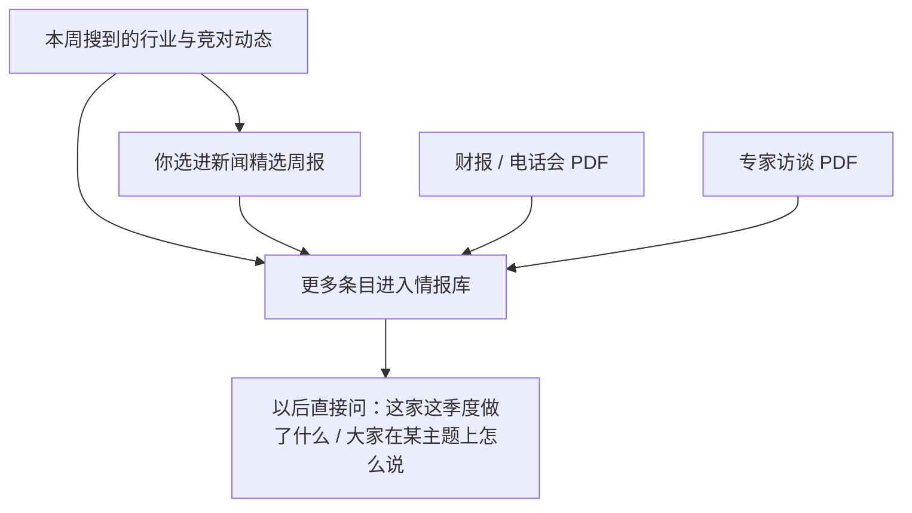
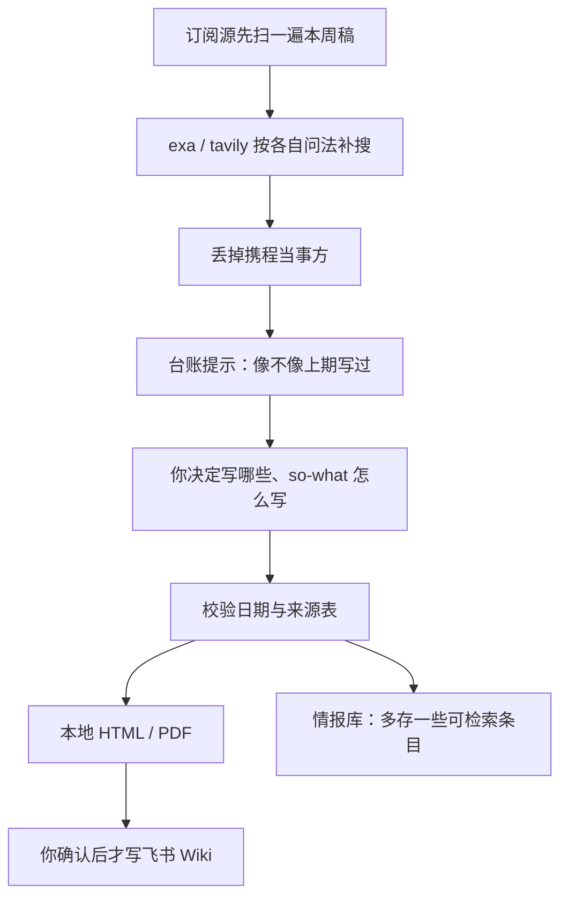
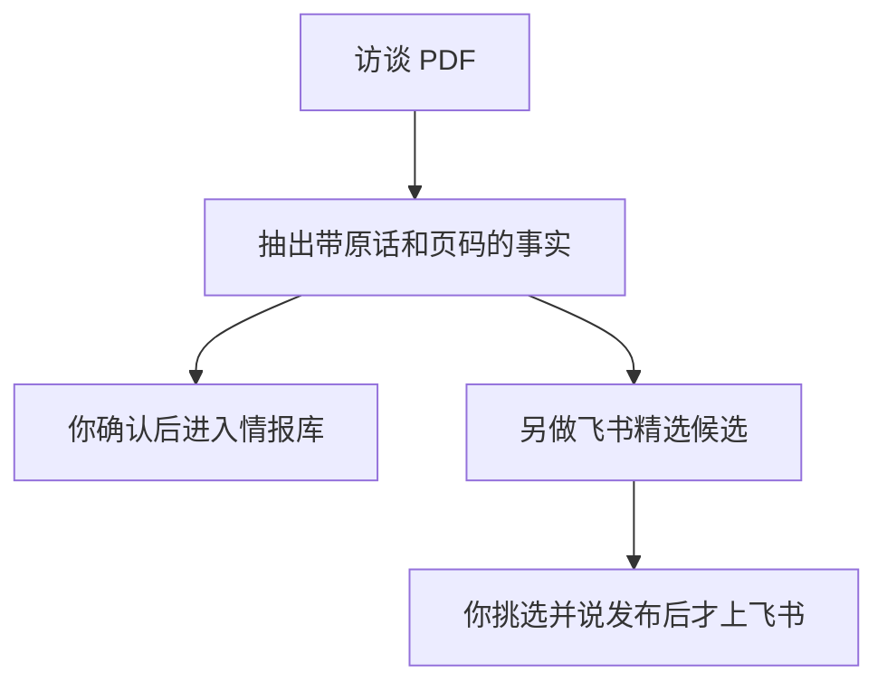

# 携程 IR 部门 · AI 自动化工作台

> 飞书版与本文同一份：https://trip.larkenterprise.com/docx/U3tWdBWT4oOKK3xEQqgcufwNndc
>
> 这份说明写给**完全没有技术背景**的同事。你不需要懂代码、不需要开黑色命令行窗口。打开工作台文件夹，对右侧的 AI 像跟同事说话一样开口就行。
>
> 有一件事请从头记住：**改权威数据、对外发布，一定要你先说「确认」**。没听到这句话之前，系统只给你看草稿、做演练，不会真的改表或发到飞书。

## 一、这个工作台是干什么的

IR 每周、每月、每季度都有一批又机械又容易抄错的活：找行业新闻并去重、填行业数据看板、抄民航局月报、更新竞对财务模型、做股东名册、从专家访谈里捞独家数字。这些脏活交给工作台；**写什么、信哪个口径、能不能发出去，仍然是你说了算**。

目前挂在同一个入口上的是九件事。对外只交一份东西：旅行行业新闻精选。其余都是内部用的。

| 你想做的事 | 节奏 | 一句话 |
|---|---|---|
| 旅行行业新闻精选 | 每周 | 找同行和行业动作，写成周报；确认后发飞书，并顺手存进情报库 |
| 国内行业数据与看板 | 每周 / 每月 | Excel 有变动就出洞察草稿，你点头后刷新 datamax.fun |
| 航空月度官方数据 | 每月 | 抓民航局和三大航公告，算同比，填进底稿指定格 |
| 竞对情报库 | 随时查 / 每季补 | 按公司或主题问「最近做了什么、怎么说的」 |
| 专家访谈 | 访谈到了就做 | 从几十页纪要里捞独家事实入库；值得展示的另发飞书 |
| Peers 财务模型 | 每季 / 半年 / 年 | 把财报数字写入 Excel 副本，原模型不会被覆盖 |
| 机构股东名册 | 每季 | 用 Capital IQ 两张底表生成完整名册 |
| 港股市场查询 | 按需 | 南向持股、港美成交占比（盯 55% 监管线） |
| 卖方研报摘读 | 按需 | 把 PDF 拖进来，帮你读、帮你摘，不建档案 |

## 二、第一次用：做一次开箱

只有第一次拿到工作台、或者换了新电脑时需要做。做完之后，日常永远只是开口说话。

**先装这几样。**Cursor（公司有会员，你和 AI 说话的窗口）；Python 3.14 或更高（安装时勾选 Add to PATH，搞不定找交付人或 IT）；Node.js LTS（为了装飞书工具）；exa 和 tavily 两个 Cursor 插件（新闻检索用，API key 问交付人或自己注册，有免费额度）。装完 Node 之后，对 AI 说「帮我装 lark-cli」即可。如果还想导出新闻精选的 PDF，再说一句「帮我装 playwright」。

**然后打开文件夹。**从交付人处拿到完整的 IR_workbench（GitHub 私有仓 ir-workbench，里面已经带上行业数据底稿和三份 Peers Model）。用 Cursor 打开这个文件夹，对右侧 AI 说：

👉「帮我做首次初始化：安装工作台依赖、检查飞书授权」

飞书会引导你**用自己的账号**扫码。授权跟这台电脑当前登录的人走，不绑任何离职同事。再对 AI 说「做一次环境自检」。全绿就可以开工；黄/红项它会用人话告诉你缺什么。

## 三、之后每次都是同一套配合方式

你开口 → 系统去取数、比对、查重、排版 → 把草稿给你看 → 你说确认 → 才写入或发布。

两个最常用的例子：说「更新国内行业数据」，你先看到变动格子和中文洞察草稿，确认「写入上线」之后看板才刷新。说「做这周的新闻精选」，你先看到已查重的候选和成稿，确认发布之后飞书 Wiki 才更新，情报库也会把这期要点存下来。

## 四、它们怎么连在一起

工作台不是九个互不相干的按钮。对你来说，最需要建立的一张图是：**新闻周报是对外交的那一份；情报库是内部随时能问的档案。两者连着，但不是同一件事。**

为了解决什么：竞对业绩和电话会口径经常要反复找，日常动态也容易 miss，专家访谈里的行业 context 以前无处沉淀。所以库从三处往里装——每周新闻、财报/电话会材料、专家访谈。写 Appendix 或准备业绩会时，直接问「Booking 这季度在 B2B 上做了什么」，而不用重新翻文件夹。

跑每周新闻精选的时候，会**并行**提示你把事件落入情报库。正常情况下，**存进情报库的事件包含、并且多于进入周报的事件**。周报要克制、对外；库可以多存一些，方便以后检索。

另外还有一份长期底稿：国内行业数据那张 Excel。看板、洞察、飞书卡片周报里的行业数字，都从这张表来。改数只改这一份，不要去改系统生成的网页文件。

## 五、每一项：你做什么、输入什么、得到什么

### 1. 旅行行业新闻精选（每周）

为了解决：每周要在海量资讯里找 OTA 和旅游行业动作，手工去重、写增量分析、排版发出去。

**你要准备的：**开口即可。有剪报或公众号导出可以拖进对话框，不是必须。

**你怎么说：**「做这周的新闻精选」或「做 2026年8月第3周的新闻精选」。

**你这一侧的旅程：**

1. 开口。系统去搜、过滤、查重，把候选和草稿给你。
2. 你做业务判断：这条写不写、so-what 怎么写、数字对不对。工具不替你编观点。
3. 定稿后系统出本地 Markdown / HTML / PDF，并问你要不要发飞书 Wiki。你说「可以 / 确认」才写入旅业资讯库和历史周报汇总。
4. 同期把要点存进情报库（你会看到一份打标草稿，核对公司标签后确认入库）。
5. 如果还要往内部群发卡，另说一句「做这周飞书卡片周报」。卡片会私聊发到**你自己**的飞书上，你再转发到群，不绑别人的账号。

**你得到：**本地三件套；确认后的飞书 Wiki；情报库里可检索的本周动态；可选的群卡片。

**背后发生了什么（所以它不是黑盒）：**

搜，不是随便问一句「本周 OTA 有什么新闻」。单靠开放搜索会被当周最大声量话题挤占，实测会漏掉同周其他酒旅重点。所以先走**订阅源枚举**（英文侧 Skift、中文侧 36氪等能稳定拉到的源），保证本周窗口里的稿件被扫一遍；再由 AI 用两套搜索做**补充**：中文描述式问法交给 exa，短关键词交给 tavily，两边问法不一样、不能拿同一句话喂两次。环球旅讯、晚点这类订阅经常拉不到，就靠这一步补上。

搜回来还不能直接当「本周新闻」。文章发布日只负责被发现；**事件发生日才决定算哪一周**。本周只是复盘旧事、没有新信息的，不收。每条都要能说清：本周新增了什么。

过滤有一条硬纪律：**携程自己当当事人的新闻一律不写**（被约谈、被处罚、发自家财报或产品）。凡这类境内事件 IR 已经第一时间掌握，写进去是浪费篇幅。标题里出现「携程」会直接被拦住；正文为了写对竞对的含义提到携程，是允许的。

查重也不替你做最终判断。系统有一份跨期台账，用链接、事件指纹（谁做了什么）、标题相似度去报「这条像不像上期写过」。像不像跟进报道，由你看。自动剔除会漏掉真正该写的跟进（比如上期写了 Booking 的 B2B，这期 CEO 兼任才是新信息）。

写字这一步不自动化。召回、查重、校验、导出、沉淀是机器的；那两三句 so-what 是你的判断。

### 2. 国内行业数据与看板（每周 / 每月）

为了解决：STR 酒店和航司周报要填表、算同比环比、写中英文洞察、再同步到对外看板，手工又慢又容易抄错格。

**你要准备的：**在锁定的那份《国内行业数据》Excel 里填好本周数字并保存；若收到中金周报，把表拖进对话框或放进收件箱。

**你怎么说：**「更新国内行业数据」；或「用这份中金周报更新看板」。

**旅程：**系统逐格比对上次，只对**真的变了**的周/月/季出中文洞察草稿（不会无故让你审一篇全量作文）。你改两句或点头后，说「确认无误，写入上线」。系统才入库、译英文、推到 datamax.fun。

**你得到：**看板刷新、中英文洞察。飞书多维表现在不在默认链路，需要时单独说。

**背后：**全部门只认被锁定的那一份 Excel。系统生成的数字快照和网页都是投影，不要手改。中金表只会填**空着的格子**，你手填过的值不会被覆盖。如果一次空出太多格，会停下来问你是不是误删，防止脏数据冲上看板。

### 3. 航空月度官方数据（每月）

为了解决：每月去民航局和三大航官网扒公告、抄数、算同比、填指定单元格。

**你要准备的：**开口即可。想留一份公告 PDF 底可以放进收件箱，不是必须。

**你怎么说：**「更新 7 月航空官方数据」。

**旅程：**系统先抓官方、校验、给你看「打算写哪几格」（演练）。你确认后才写进 Excel，并留下每一格从哪张公告、哪一行来的记录。

**你得到：**底稿里四个目标格更新，可核对来源。

### 4. 竞对情报库（随时问）

为了解决：信息散落在周报、财报文件夹和访谈 PDF 里，季度研究时找不到历史口径。

**你要准备的：**日常查询不用准备。要把当季财报/电话会存进去时，把材料包交给 AI（或放进按公司、按财季分的收件箱）。

**你怎么说：**

- 「Booking 这季度在 B2B 上做了什么」（按公司）
- 「所有 peers 在 AI 入口上分别做了什么、怎么说」（按主题横切）
- 「把这季 Booking 电话会口径存进情报库」

**你得到：**带出处的结构化回答。建档公司包括 Booking、Expedia、Airbnb、美团、同程、飞猪、豆包/抖音、携程等；华住、亚朵、万豪等可以搜到，但是轻量跟踪，不会按完整经营模型拆。

**背后：**新闻通道每周随周报走；专家访谈是另一条高价值通道；财报季材料是按需跑的——电话会原话这类，真要做季报定位时再专门沉淀一次。公司披露类正常项可以自动入库，对不上、口径不清的会单独拎出来问你，系统不替你选哪个数。

### 5. 专家访谈（访谈到了就做）

为了解决：专家电话会里有许多公开渠道拿不到的行业事实和经营数据，等到做研究再逐篇翻，又慢又容易漏；同时也需要挑少数值得放到飞书上的精选。

**你要准备的：**AlphaSense 上下载的访谈 PDF，拖进对话框或丢给 AI。有事没事下一批竞对相关访谈、发给工作台，等于在建设部门自己的 OTA 知识库。

**你怎么说：**「读一下这些专家访谈，把有价值的信息存进公司情报库」；「看看这些访谈哪些值得写进飞书」。

**旅程（两条线，互不挡路）：**

1. 系统按页读 PDF，抽出带**专家原话和页码**的事实草稿。
2. 你把条目分成：可以正式入库、有价值但先待核、不要。确认后才写入情报库。待核的不会自动转正。
3. 另一条线给飞书展示打分（建议档 A/B/C），只辅助你选。你选定、审草稿，明确说「发布专家访谈精选」才写飞书。

一篇访谈即使不适合整篇上飞书，里面可核对的数字仍然可以进情报库。反过来，发了飞书也不等于已经入库——两条确认是分开的。

### 6. Peers 财务模型（每季 / 半年 / 年）

为了解决：竞对出业绩后，要把新数字写入我们维护的财务 Excel，并对齐上期格式、公式和图表。业绩总结正文仍然是人写，工作台不自动做 Word Appendix。

**你要准备的：**这家公司当次的财报或电话会 PDF。一次只更新一家。权威三份 Model 已经在工作台里：BKNG/EXPE/ABNB 共用一本，美团一本，同程一本。

**你怎么说：**「这是 BKNG 26Q3 财报，更新 Model」；「用这份美团半年报更新 26H1」。

**旅程：**系统先抽数，再独立重读 PDF 复核；有冲突先列给你选口径。你说「确认写入模型副本」之后，才在**副本**上加期间列、套格式、更新图。原模型不覆盖。写完会关掉重开 Excel 再对一遍账。

**你得到：**一份更新后的 Excel 副本。问「BKNG 模型副本在哪」就能取回。同程只动该动的前两个数据表，其余表不会被改。

### 7. 机构股东名册（每季）

为了解决：看我们自己的股东结构，并和 Peers、中概互联网做横向对比。表格里很多 sheet 都是从底表衍生出来的子集，所以**你主要的手动工作就是下载新的股东底表**，其余交给工作台。

**你要准备的：**从 Capital IQ 导出两张表，放在电脑「下载」里即可（不必和上期名册放一起）：Peer Holdings（不要 Public 版）、Institution Combined Ownership。上一期已定稿的名册工作台里有。

**你怎么说：**「更新 shareholder list，有效日切成今天」。只想把当前有效日那一本重算一遍、不是出新一期时，说「重建 shareholder list」，不要当成新切。日历翻过去了，不等于自动出下一本——必须你先说出有效日。

**你得到：**新的 Investor List 表格。不要手改格子；不对就让 AI 按规则再跑。交差文件问「股东名册在哪」。

### 8. 港股查询、卖方研报（按需）

港股：直接问「港美成交占比现在多少」「南向持股这周怎么样」。盯的是 55% 那条监管线，口径只看最近完整财年，不是随口一个滚动 12 个月。

研报：把 PDF 拖进对话框，「帮我摘一下这份 UBS 酒店 first read」。帮你读、帮你摘，**不建长期档案、不进情报库**。要沉淀的是公司自己的披露和专家事实，不是券商观点。

## 六、东西往哪放、从哪取

你不必自己建文件夹。三种交法：拖进对话框（最省事）；股东底表留在「下载」里说一声；换行业数据 Excel 或新版 Model 放到工作台对应位置后再说「换一份 / 锁定」。

| 你手里的东西 | 怎么交 |
|---|---|
| 中金周报、STR、研报、财报、访谈 PDF | 拖进对话框 |
| Capital IQ 两张股东底表 | 放「下载」，说更新 shareholder list |
| 新的国内行业数据 Excel | 放到工作台的数据底稿位置，说「换一份」 |
| 新版 Peers Model | 放到模型文件夹，让 AI 锁定 |

要取回成品，直接问：「这期新闻精选在哪」「BKNG 模型副本在哪」「股东名册在哪」。临时草稿可以清；底稿归档和情报库不会被清掉。

更细的文件夹地图见 [MAP.md](MAP.md)。日常仍建议问 AI，不必记路径。

## 七、请记住这几条

1. 改行业数据只改那一份 Excel，不要手改系统生成的数字文件或看板网页。
2. 新闻精选不写携程自己当当事人的新闻。
3. 没说「确认 / 写入上线 / 发布」之前，系统不能对外发、不能覆盖权威表。
4. 飞书身份是这台电脑当前登录的你，换人换电脑重新登自己的号即可。
5. 自动做 Peers 业绩总结 Word 已经停了。模型走上面第 6 项；Appendix 正文仍由人写。

卡住了就问这三句：「现在什么状态？」「做一次环境自检」「换一份新的国内行业数据」。

这套工作台把部门已经验证过的做法固化下来：你继续做判断，它负责不漏搜、不抄错格、不把没点头的东西发出去。
